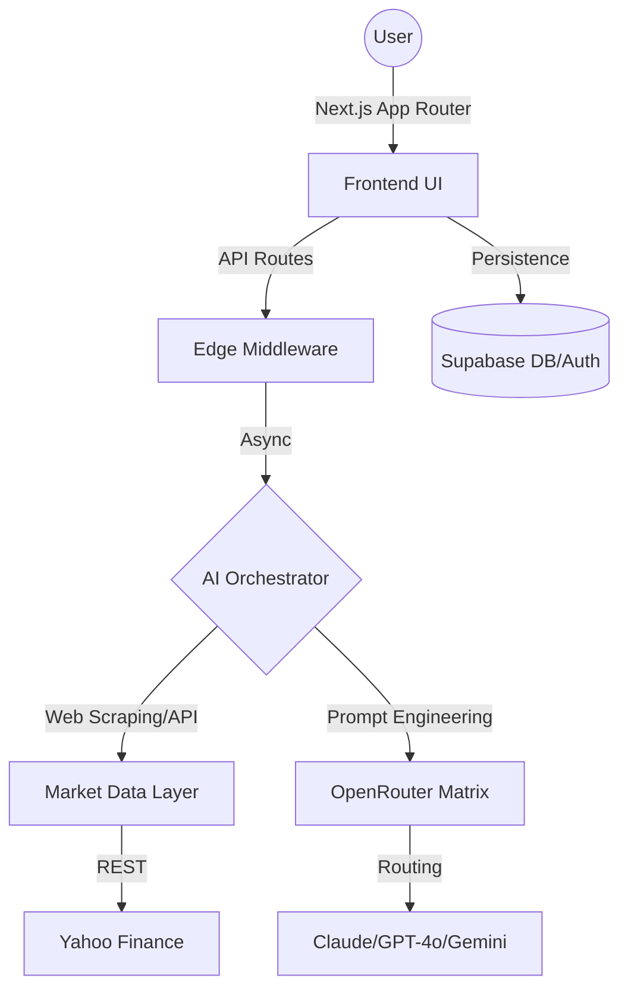
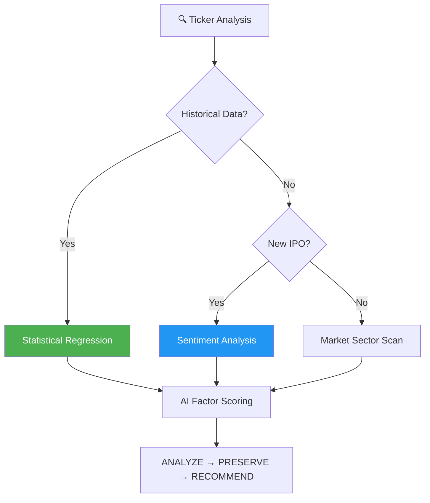

Official X Account: https://x.com/jerrilagent </br>
Official Website: https://www.jerrilfinancialagent.site/

Contract Address: Ge45ZxTGm4q7A9ZTce8tVxyTTHSy3ujpB6eZC6Uopump

<p align="center">
  
</p>

<h1 align="center">JerrilHub</h1>

<p align="center">
  <strong>The High-Performance Quantitative Intelligence Layer for Modern Markets</strong>
</p>

<p align="center">
  <a href="https://nextjs.org/"></a>
  <a href="https://www.typescriptlang.org/"></a>
  <a href="https://www.python.org/"></a>
  <a href="https://www.rust-lang.org/"></a>
</p>


---

## ⚡ The Logic of JERRIL

When the age of financial AI began, it did not begin gently. New systems appeared almost overnight — faster, sharper, relentlessly optimized. They were engineered to predict before others could react, to trade before others could think, to capture opportunity with mechanical precision. Every model was built with the same ambition: outperform, outpace, outmaneuver. The markets became an arena of algorithms.

**JERRIL was born from a different question: What if intelligence didn’t have to be aggressive to be powerful?**

JerrilHub is not just a dashboard; it is a **multi-nodal orchestration engine** designed to bridge the gap between complex quantitative data and human-centric decision-making. While others focus on beating the market, JERRIL focuses on guiding the person navigating it. 

---

## 🏗 Modular Architecture

JerrilHub is built with a decoupled architecture to ensure high availability and low latency.



### 🔐 Multi-Tier Authentication
Integrated with **Supabase Auth**, the system supports:
- **Guest Sessioning**: Stateless interaction for immediate utility.
- **Operator Persistence**: Full JWT-based sessions for encrypted watchlist and history synchronization.

### 📡 Data Synchronization
- **Market Sockets**: Simulated real-time telemetry for 28+ quantitative factors.
- **Historical Regression**: 60-day buffer mapping for technical projection.

---

## 🛠 Core Technical Stack

| Layer | Technology | Implementation Detail |
|----------|----------------------|-----------------------|
| **Frontend** | Next.js 14 (App Router) | React Server Components & Edge Runtime Optimization |
| **State Management** | React Context + URL State | Deep-linkable research trajectories |
| **3D Rendering** | React Three Fiber (R3F) | GLSL Shaders & Physics-synced "Thinking" animations |
| **Real-time Data** | Yahoo Finance SDK | Synchronous market capture & historical regression mapping |
| **AI Orchestration** | OpenRouter Matrix | Dynamic routing with failure-recovery (Claude 3.5 ↔ GPT-4o-mini) |
| **Persistence** | Supabase (PostgreSQL) | RLS-protected (Row Level Security) user data sync |
| **Styling** | Tailwind CSS + Framer Motion | High-fidelity Glassmorphic HUD interface |

---

## 🧠 Intelligence Engine (Neural Pipeline)

JerrilHub employs a **Triple-Verification Pipeline** for every asset analysis:

1.  **Ingestion Layer**: Asynchronous fetching of TICKER telemetry via Yahoo Finance SDK.
2.  **Specialization Nodes**:
    - `Nodal-A (Fundamental)`: Balance sheets, Cash Flow metrics, and Growth projections.
    - `Nodal-B (Technical)`: RSI 14, MACD divergence, and Volume profile analysis.
    - `Nodal-C (Sentiment)`: News aggregate synthesis and Social-Market weighting.
3.  **Synthesis (The JERRIL Core)**: Synthesizes disparate data into a unified, markdown-ready IQ score.
4.  **Holographic Mapping**: Real-time state mapping to the 3D HUD animation states.

---

### 1. The Multi-Agent Orchestrator
The backend leverages specialized system instructions ("Modalities") to simulate various expert roles:
- **Warren_Mod**: Deep fundamental logic focusing on value, growth, and cash flow stability.
- **Quant_Mod**: Aggressive technical analysis focusing on volatility and momentum.

### 2. R3F Physical State Sync
The 3D **JerrilAgent Core** is integrated into the React lifecycle. Animation states are triggered by IPC (Inter-Process Communication) simulation:
- **IDLE**: Connection standby, low-energy respiration animation.
- **THINKING**: Multi-threaded scanner activation, increased vertex oscillation.
- **RESOLVED**: Success lighting pulse (cyan) or risk alert pulse (orange).

---

## 🚀 Deployment & Engineering

### Prerequisites
- **Node.js** ^18.17.0
- **Pnpm** (Recommended for deterministic dependency resolution)

### Environment Configuration
Create a `.env.local` file with the following neural parameters:
```env
# Supabase Configuration
NEXT_PUBLIC_SUPABASE_URL=your_supabase_url
NEXT_PUBLIC_SUPABASE_ANON_KEY=your_anon_key

# OpenRouter Configuration (Multi-model support)
OPENROUTER_API_KEY=your_key
```

### System Initialization
```bash
# Install dependencies
pnpm install

# Initialize local development environment
pnpm dev

# Build production artifacts
pnpm build
```

---

## 📈 Performance Benchmarks

- **TTFT (Time to First Token)**: < 400ms via Vercel Edge.
- **Schema Validation**: Type-safe data handling with Zod and TypeScript.
- **Layout Shift (CLS)**: Scaled to zero-jitter via optimized skeleton loading.
- **Resource Usage**: Lazy-loaded 3D assets to minimize initial hydration payload.

---

## 🛡 Security & Ethics

JERRIL is engineered as an **Ethical Guardrail**. It is programmed to identify "FOMO" patterns and high-risk liquidity traps, prioritizing clarity over speculative hype. It is an intelligence that serves before it competes—calm in chaos, patient in volatility.

---

## 🤝 Contribution & Governance

Join the development of the next-gen financial intelligence layer. Follow the [Developer on X](https://x.com/jerrilagent) for system updates.

[MIT License](./LICENSE) | Created by **decimasudo**


---

## JerrilAgent Intelligence Methodology

JerrilAgent's core engine uses a multi-layered verification cycle for every stock ticker.



### Analytical Cycles

| Phase | Strategy | Purpose |
|-----------|-------------|---------|
| **Quant Search** | Technical Scan | Volume, MACD, and RSI verification |
| **Logic Reasoning** | Fundamental Check | P/E Ratio, Debt-to-Equity, Cash Flow analysis |
| **Sentiment** | Social Perception | News and social media aggregate via AI |

---

## AI Orchestration Layer

JerrilHub is a **strategic orchestrator** that delegates high-latency reasoning to specialized virtual analyst nodes:

- **Market Analysts**: Valuation metrics, growth projections, and dividend safety.
- **Risk Managers**: Alpha/Beta calculations, volatility tracking, and hedging strategies.
- **Researchers**: News sentiment, insider trading activity, and sector rotation analysis.

---

## Model Optimization Policy

JerrilAgent dynamically assigns models via OpenRouter to balance cost and accuracy.

| Tier | Model | Best For |
|---------|-------|----------|
| **Premium** | Claude 3.5 Sonnet | Deep fundamental reasoning and complex reports |
| **Standard** | GPT-4o-mini | Sentiment analysis and quick ticker summaries |
| **Flash** | Gemini 1.5 Flash | Real-time greeting and layout interactions |

---

## The Workflow: Plan → Analyze → Manage

### 📋 Phase 1: Discovery
- Identifying Trending Tickers
- Sector Rotation Analysis
- Market Hotspots Mapping

### 🔨 Phase 2: Intelligence
- Real-time Price Synchronization
- JerrilAgent Thinking Process (Multi-modal)
- AI Justification & Market Sentiment (Bull vs Bear)

### 📄 Phase 3: Portfolio
- Watchlist Tracking & Risk Alerts
- Intelligent Portfolio Rebalancing
- Performance Monitoring

---

## CLI & Scripts

| Command | Description |
|---------|-------------|
| `pnpm dev` | Launch local development environment |
| `pnpm build` | Production-ready Next.js build |
| `pnpm lint` | Run ESLint check for code quality |
| `pnpm start` | Run production server |

---

## Folder Structure

```
quantai/
├── src/
│   ├── app/              # App Router Pages (Dashboard, Auth, Skills)
│   ├── components/       # UI & Dashboard Widgets
│   │   ├── Robot3D.tsx   # JerrilAgent 3D Core
│   │   └── dashboard/    # Market Views & Charts
│   ├── lib/              # Core Logic (Market APIs, AI, Supabase)
│   └── types/            # TypeScript Definitions
├── public/               # Static Assets & Metadata
└── web3-data-pipeline/   # On-chain data processing units
```

---

## FAQ

### Q: Where does the market data come from?
We use the Yahoo Finance API (via `finance-yahoo-query`) for real-time and historical equity data.

### Q: Is JerrilAgent purely cosmetic?
No. While it provides a 3D visual presence, its state is synchronized with the **Thinking Process** component. When the AI is "Thinking", the JerrilAgent scanner in the chest area increases frequency and the robot displays "active" animations.

---

## Community & Contributing

Follow the development on our [GitHub Discussions](https://github.com/decimasudo/jerrilagent/discussions) or follow the creator on [X (Twitter)](https://x.com/jerrilagent).

### Quick Contribution Guide

1. Forge the repo
2. Create your branch
3. Run `pnpm lint` before submitting PR
4. Ensure all environment variables are correctly mocked in tests

---

## Star History

[](https://star-history.com/#decimasudo/jerrilagent&date)

---

## License

[MIT](./LICENSE) -- Created by decimasudo.

## Links

- [OpenRouter API](https://openrouter.ai/)
- [Supabase Auth](https://supabase.com/auth)
- [Next.js Documentation](https://nextjs.org/docs)
