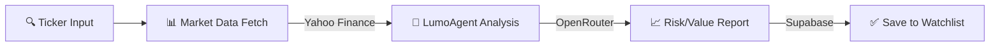
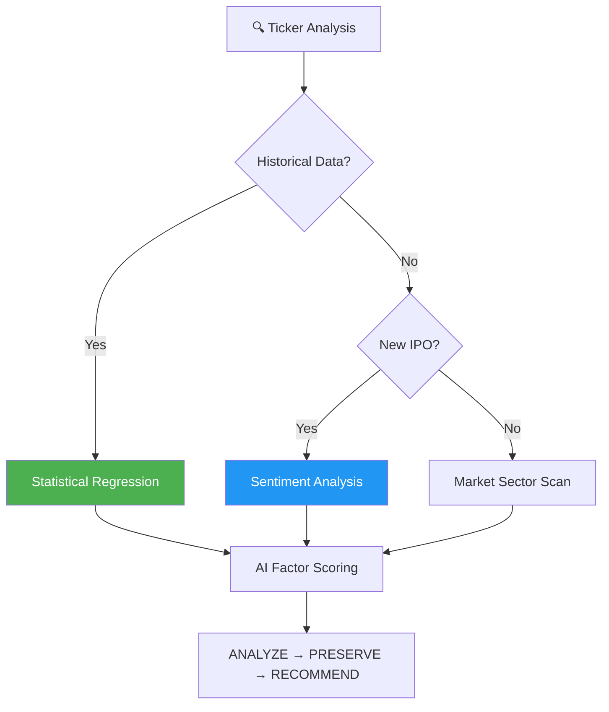

Official X Account: https://x.com/Lumoagent </br>
Contract Address: 

<p align="center">
  
</p>

<h1 align="center">LumoHub</h1>

<p align="center">
  <strong>The High-Performance Quantitative Intelligence Layer for Modern Markets</strong>
</p>

<p align="center">
  <a href="https://github.com/decimasudo/lumoagent/actions"></a>
  <a href="https://nextjs.org/"></a>
  <a href="https://www.typescriptlang.org/"></a>
</p>


---

## ⚡ The Logic of LUMO

When the age of financial AI began, it did not begin gently. New systems appeared almost overnight — faster, sharper, relentlessly optimized. They were engineered to predict before others could react, to trade before others could think, to capture opportunity with mechanical precision. Every model was built with the same ambition: outperform, outpace, outmaneuver. The markets became an arena of algorithms.

**LUMO was born from a different question: What if intelligence didn’t have to be aggressive to be powerful?**

LumoHub is not just a dashboard; it is a **multi-nodal orchestration engine** designed to bridge the gap between complex quantitative data and human-centric decision-making. While others focus on beating the market, LUMO focuses on guiding the person navigating it. 

---

## 🛠 Core Technical Stack

| Layer | Technology | Implementation |
|----------|----------------------|-------|
| **Frontend** | Next.js 14 (App Router) | React Server Components & Edge Runtime |
| **3D Rendering** | React Three Fiber | Real-time state-synced "System Thinking" Visualizer |
| **Real-time Data** | Yahoo Finance SDK | Synchronous market capture & historical regression |
| **AI Orchestration** | OpenRouter (LLM Matrix) | Dynamic routing between Claude 3.5 & GPT-4o-mini |
| **Auth & DB** | Supabase (PostgreSQL) | Secure session management & encrypted watchlist sync |

---

## 🧠 System Architecture

LumoHub employs a **Triple-Verification Pipeline** for every asset analysis:

### **The Multi-Nodal Workflow**
1.  **Ingestion**: Streaming market data via Yahoo Finance SDK.
2.  **Specialization**: Parallel node processing for Technical, Fundamental, and Sentiment layers.
3.  **Orchestration**: LUMO Core synthesizes disparate data into a unified IQ score.
4.  **Visualization**: Real-time state mapping to the 3D HUD.

---

### 1. The Multi-Agent Orchestrator
Unlike static bots, LumoHub delegates complex reasoning to specialized sub-prompts:
- **Warren_Mod**: Deep fundamental logic focusing on value, growth, and cash flow stability.
- **Quant_Mod**: Aggressive technical analysis focusing on volatility, RSI, and MACD divergence.

### 2. Physical State Sync
The 3D **LumoAgent Core** is not cosmetic. Its animation states are directly mapped to the API response lifecycle:
- **Idle**: WebSocket connection standby.
- **Thinking**: Token-by-token streaming visualization.
- **Success/Alert**: Reactive lighting based on risk assessment results.

---

## 🚀 Deployment & Engineering

### Prerequisites
- **Node.js** ^18.17.0
- **Pnpm** (Deterministic dependency resolution)

### Quick Start
```bash
git clone https://github.com/decimasudo/lumoagent.git
cd lumoagent
pnpm install
pnpm dev
```

### Environment Configuration
Required variables for the intelligence layer:
```env
NEXT_PUBLIC_SUPABASE_URL=...
NEXT_PUBLIC_SUPABASE_ANON_KEY=...
OPENROUTER_API_KEY=... # For multi-model orchestration
```

---

## 📈 Performance Benchmarks

- **Time to First Token (TTFT)**: < 400ms via Vercel Edge.
- **Data Latency**: Synchronized within 2s of global market ticks.
- **Factor Coverage**: 28+ distinct quantitative metrics per ticker.

---

## 🛡 Security & Ethics

LUMO is engineered as an **Ethical Guardrail**. It is programmed to identify "FOMO" patterns and high-risk liquidity traps, prioritizing clarity over speculative hype. It is an intelligence that serves before it competes—calm in chaos, patient in volatility.

---

## 🤝 Contribution & Governance

Join the development of the next-gen financial intelligence layer. Follow the [Developer on X](https://x.com/Lumoagent) for system updates.

[MIT License](./LICENSE) | Created by **decimasudo**



---

## LumoAgent Intelligence Methodology

LumoAgent's core engine uses a multi-layered verification cycle for every stock ticker.



### Analytical Cycles

| Phase | Strategy | Purpose |
|-----------|-------------|---------|
| **Quant Search** | Technical Scan | Volume, MACD, and RSI verification |
| **Logic Reasoning** | Fundamental Check | P/E Ratio, Debt-to-Equity, Cash Flow analysis |
| **Sentiment** | Social Perception | News and social media aggregate via AI |

---

## AI Orchestration Layer

LumoHub is a **strategic orchestrator** that delegates high-latency reasoning to specialized virtual analyst nodes:

- **Market Analysts**: Valuation metrics, growth projections, and dividend safety.
- **Risk Managers**: Alpha/Beta calculations, volatility tracking, and hedging strategies.
- **Researchers**: News sentiment, insider trading activity, and sector rotation analysis.

---

## Model Optimization Policy

LumoAgent dynamically assigns models via OpenRouter to balance cost and accuracy.

| Tier | Model | Best For |
|---------|-------|----------|
| **Premium** | Claude 3.5 Sonnet | Deep fundamental reasoning and complex reports |
| **Standard** | GPT-4o-mini | Sentiment analysis and quick ticker summaries |
| **Flash** | Gemini 1.5 Flash | Real-time greeting and layout interactions |

---

## The Workflow: Plan → Analyze → Manage

### 📋 Phase 1: Discovery
- Identifying Trending Tickers
- Sector Rotation Analysis
- Market Hotspots Mapping

### 🔨 Phase 2: Intelligence
- Real-time Price Synchronization
- LumoAgent Thinking Process (Multi-modal)
- AI Justification & Market Sentiment (Bull vs Bear)

### 📄 Phase 3: Portfolio
- Watchlist Tracking & Risk Alerts
- Intelligent Portfolio Rebalancing
- Performance Monitoring

---

## CLI & Scripts

| Command | Description |
|---------|-------------|
| `pnpm dev` | Launch local development environment |
| `pnpm build` | Production-ready Next.js build |
| `pnpm lint` | Run ESLint check for code quality |
| `pnpm start` | Run production server |

---

## Folder Structure

```
lumoagent/
├── src/
│   ├── app/              # App Router Pages (Dashboard, Auth, Skills)
│   ├── components/       # UI & Dashboard Widgets
│   │   ├── Robot3D.tsx   # LumoAgent 3D Core
│   │   └── dashboard/    # Market Views & Charts
│   ├── lib/              # Core Logic (Market APIs, AI, Supabase)
│   └── types/            # TypeScript Definitions
├── public/               # Static Assets & Metadata
└── web3-data-pipeline/   # On-chain data processing units
```

---

## FAQ

### Q: Where does the market data come from?
We use the Yahoo Finance API (via `finance-yahoo-query`) for real-time and historical equity data.

### Q: Is LumoAgent purely cosmetic?
No. While it provides a 3D visual presence, its state is synchronized with the **Thinking Process** component. When the AI is "Thinking", the LumoAgent scanner in the chest area increases frequency and the robot displays "active" animations.

---

## Community & Contributing

Follow the development on our [GitHub Discussions](https://github.com/decimasudo/lumoagent/discussions) or follow the creator on [X (Twitter)](https://x.com/Lumoagent).

### Quick Contribution Guide

1. Forge the repo
2. Create your branch
3. Run `pnpm lint` before submitting PR
4. Ensure all environment variables are correctly mocked in tests

---

## Star History

[](https://star-history.com/#decimasudo/lumoagent&date)

---

## License

[MIT](./LICENSE) -- Created by decimasudo.

## Links

- [OpenRouter API](https://openrouter.ai/)
- [Supabase Auth](https://supabase.com/auth)
- [Next.js Documentation](https://nextjs.org/docs)
