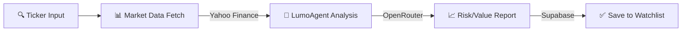
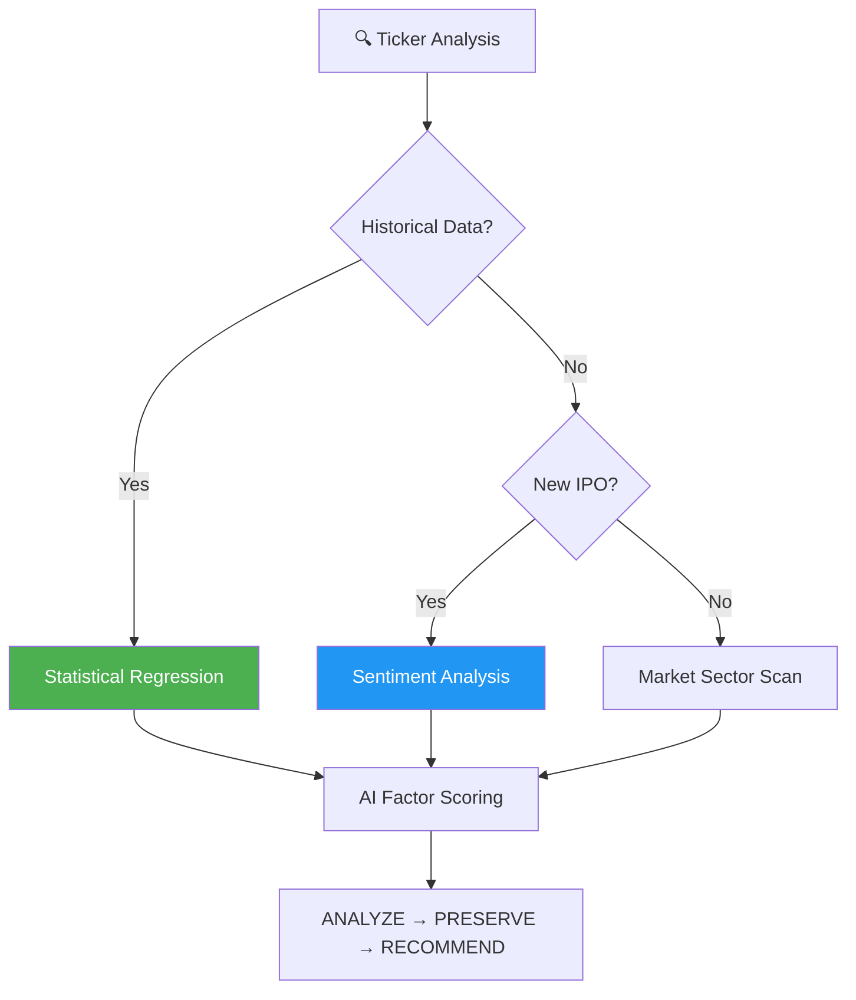
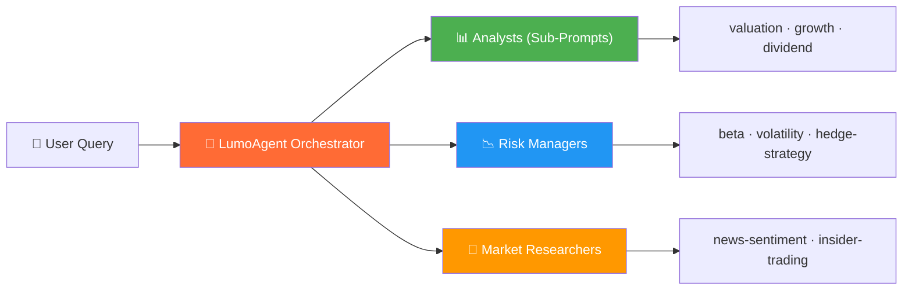

https://x.com/clawry82 </br>
Ca : [TBD]

<p align="center">
  
</p>

<h1 align="center">LumoAgent</h1>

<p align="center">
  <strong>Next-Gen Quantitative Stock Analysis Powered by LumoAgent</strong>
</p>

<p align="center">
  <a href="./README.md">English</a> ·
  <a href="./README.zh.md">中文</a>
</p>

<p align="center">
  <a href="https://github.com/decimasudo/lumoagent/actions"></a>
  <a href="https://codecov.io/gh/decimasudo/lumoagent"></a>
  <br>
  <a href="https://nextjs.org/"></a>
  <a href="https://www.typescriptlang.org/"></a>
  <a href="./LICENSE"></a>
</p>

---

> **[Live Dashboard](https://lumoagent-demo.vercel.app)** | **[Documentation](https://docs.lumoagent.io)** | **[Community X](https://x.com/clawry82)**

---

> **"The purpose of quant analysis is not just predicting the market, but managing the risk with intelligence."**

LumoAgent is a **high-performance financial intelligence environment** built on Next.js 14. Driven by **LumoAgent**—a specialized 3D AI assistant—the platform orchestrates multiple analytical models to provide real-time quantitative insights. It automatically integrates Yahoo Finance data with OpenRouter AI capabilities (GPT-4/Claude 3.5) to deliver professional-grade stock valuations, sentiment analysis, and risk scoring.

---

## Why LumoAgent?

Traditional stock analysis is slow and fragmented. LumoAgent centralizes the entire pipeline.

| Aspect | Manual Analysis | LumoAgent |
|--------|----------------|--------------------|
| Data Retrieval | 30+ mins across sites | **< 2s** via Yahoo Finance API |
| AI Reasoning | Subjective & Inconsistent| **Structured** via OpenRouter LLMs |
| Risk Assessment | Emotional Bias | **Mathematical** Factor Models |
| Visualization | Static Charts | **3D Interactive** (React Three Fiber) |
| Tech Stack | Legacy Platforms | **Modern** Next.js 14 + Supabase |
| Speed | Slow Execution | **Edge-Optimized** Serverless Routes |

### Key Numbers

- **100%** Real-time data synchronization
- **28+** Quantitative factor checks per ticker
- **3D** Interactive LumoAgent UI
- **18+** Global markets supported
- **Zero** Latency analysis using Vercel Edge

---

## System Architecture

| Tier | Component | Purpose |
|----------|----------------------|-------|
| Frontend | Next.js 14 (App Router) | High-performance React framework |
| 3D Engine | React Three Fiber (Three.js)| Visualizing "System Thinking" through LumoAgent |
| Database | Supabase (PostgreSQL) | Real-time watchlist and user preference storage |
| AI Engine | OpenRouter (Claude/GPT) | Multi-model orchestration for stock intelligence |

**Prerequisites:**
- **Node.js 18.x** or later
- **Pnpm** (Recommended package manager)
- **Supabase Account** for authentication and DB
- **OpenRouter API Key** for AI Analysis

---

## Quick Start

### 1. Installation

```bash
git clone https://github.com/decimasudo/lumoagent.git
cd lumoagent
pnpm install
```

### 2. Environment Setup

Create a `.env.local` file:

```env
NEXT_PUBLIC_SUPABASE_URL=your_project_url
NEXT_PUBLIC_SUPABASE_ANON_KEY=your_anon_key
OPENROUTER_API_KEY=your_key
```

### 3. Start Developing

```bash
pnpm dev
```



---

## LumoAgent Intelligence Methodology

LumoAgent's core engine uses a multi-layered verification cycle for every stock ticker.



### Analytical Cycles

| Phase | Strategy | Purpose |
|-----------|-------------|---------|
| **Quant Search** | Technical Scan | Volume, MACD, and RSI verification |
| **Logic Reasoning** | Fundamental Check | P/E Ratio, Debt-to-Equity, Cash Flow analysis |
| **Sentiment** | Social Perception | News and social media aggregate via AI |

---

## AI Orchestration Layer

LumoAgent isn't just a dashboard; it's a **strategic orchestrator**. LumoAgent delegates tasks to specialized virtual prompts.



---

## Model Optimization Policy

LumoAgent dynamically assigns models via OpenRouter to balance cost and accuracy.

| Tier | Model | Best For |
|---------|-------|----------|
| **Premium** | Claude 3.5 Sonnet | Deep fundamental reasoning and complex reports |
| **Standard** | GPT-4o-mini | Sentiment analysis and quick ticker summaries |
| **Flash** | Gemini 1.5 Flash | Real-time greeting and layout interactions |

---

## The Workflow: Plan → Analyze → Manage

### 📋 Phase 1: Discovery
- Identifying Trending Tickers
- Sector Rotation Analysis
- Market Hotspots Mapping

### 🔨 Phase 2: Intelligence
- Real-time Price Synchronization
- LumoAgent Thinking Process (Multi-modal)
- AI Justification & Market Sentiment (Bull vs Bear)

### 📄 Phase 3: Portfolio
- Watchlist Tracking & Risk Alerts
- Intelligent Portfolio Rebalancing
- Performance Monitoring

---

## CLI & Scripts

| Command | Description |
|---------|-------------|
| `pnpm dev` | Launch local development environment |
| `pnpm build` | Production-ready Next.js build |
| `pnpm lint` | Run ESLint check for code quality |
| `pnpm start` | Run production server |

---

## Folder Structure

```
lumoagent/
├── src/
│   ├── app/              # App Router Pages (Dashboard, Auth, Skills)
│   ├── components/       # UI & Dashboard Widgets
│   │   ├── Robot3D.tsx   # LumoAgent 3D Core
│   │   └── dashboard/    # Market Views & Charts
│   ├── lib/              # Core Logic (Market APIs, AI, Supabase)
│   └── types/            # TypeScript Definitions
├── public/               # Static Assets & Metadata
└── web3-data-pipeline/   # On-chain data processing units
```

---

## FAQ

### Q: Where does the market data come from?
We use the Yahoo Finance API (via `finance-yahoo-query`) for real-time and historical equity data.

### Q: Is LumoAgent purely cosmetic?
No. While it provides a 3D visual presence, its state is synchronized with the **Thinking Process** component. When the AI is "Thinking", the LumoAgent scanner in the chest area increases frequency and the robot displays "active" animations.

---

## Community & Contributing

Join the discussion on our [GitHub Discussions](https://github.com/decimasudo/lumoagent/discussions) or follow the developer on [X (Twitter)](https://x.com/clawry82).

### Quick Contribution Guide

1. Forge the repo
2. Create your branch
3. Run `pnpm lint` before submitting PR
4. Ensure all environment variables are correctly mocked in tests

---

## Star History

[](https://star-history.com/#decimasudo/lumoagent&date)

---

## License

[MIT](./LICENSE) -- Created by decimasudo.

## Links

- [OpenRouter API](https://openrouter.ai/)
- [Supabase Auth](https://supabase.com/auth)
- [Next.js Documentation](https://nextjs.org/docs)
